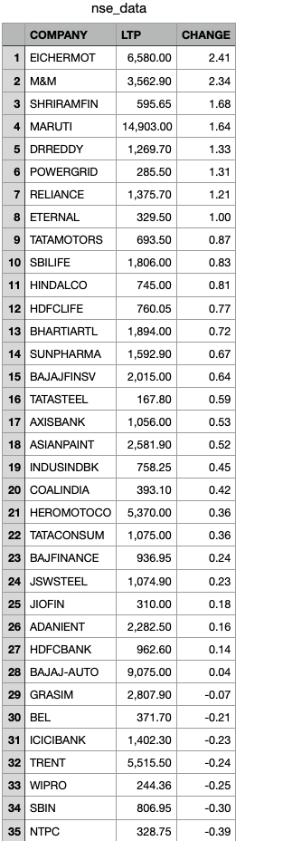

# 📊 NSE Live Market Data Scraper

## 📌 Overview
This project scrapes live stock market data from the **NSE India website** using `Selenium` and stores the output in a CSV file.  
It extracts important details like **Company Name, Last Traded Price (LTP), and % Change**.

---

## ⚙️ Tech Stack
- Python 🐍
- Selenium (Web Automation)
- Pandas (Data Handling)
- ChromeDriver

---

## 📂 Project Structure
nse/
│── nse_scraper.py # Main scraper script
│── nse_data.csv # Output data file
│── log.txt # Error/Run logs
│── screenshot.png # Sample run screenshot
│── README.md # Project documentation
---

## 📑 Features
- ✅ Extracts company name, last traded price, and % change  
- ✅ Saves data into a clean CSV file  
- ✅ Can be extended for live updates / automation  

---

## 📸 Screenshot


---

## 🚀 How to Run
1. Clone this repo or download the project folder:
   ```bash
   git clone https://github.com/your-username/web-scraping-portfolio.git
   cd nse

2.Install dependencies:

pip install -r requirements.txt

3.Run the scraper:

python nse_scraper.py


📊 Sample Output
| COMPANY   | LTP    | CHANGE |
| --------- | ------ | ------ |
| Reliance  | 2450.5 | +1.25% |
| TCS       | 3321.0 | -0.85% |
| HDFC Bank | 1567.3 | +0.45% |


📌 Notes

This scraper is for educational/demo purposes only.

Data belongs to NSE India and may change based on their website structure.


👨‍💻 Author: Abhishek kumar
📂 Repo: https://github.com/abhishekkumar269/web-scraping-portfolio.git
